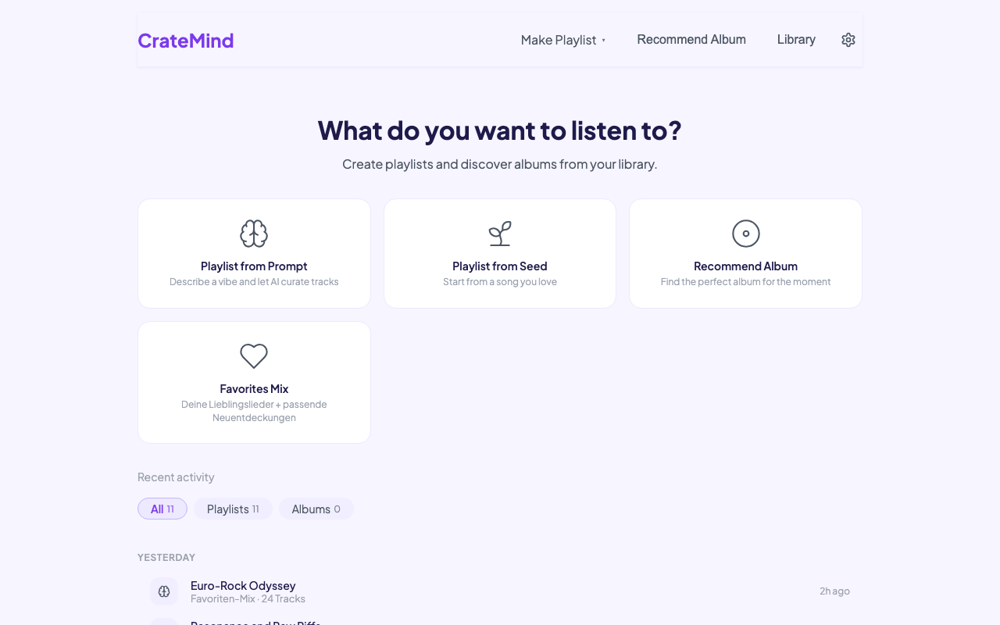
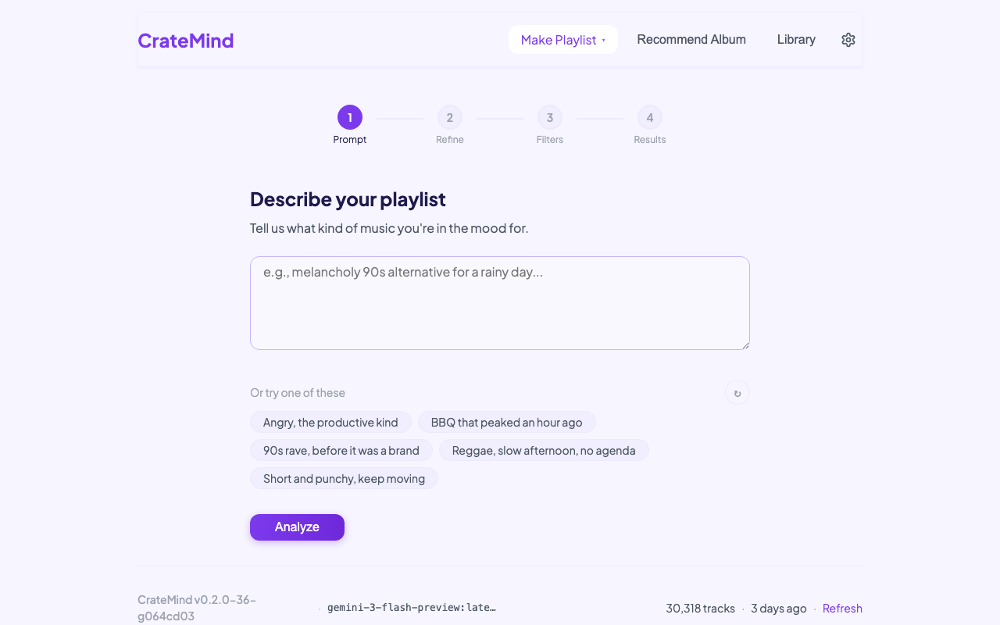
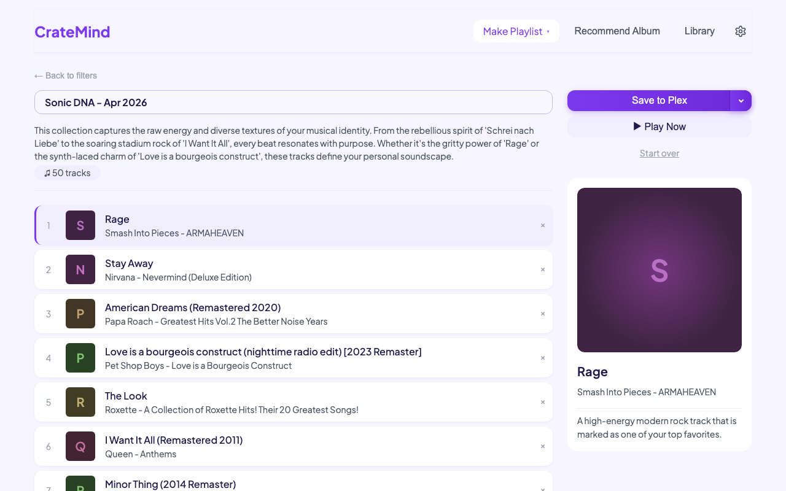
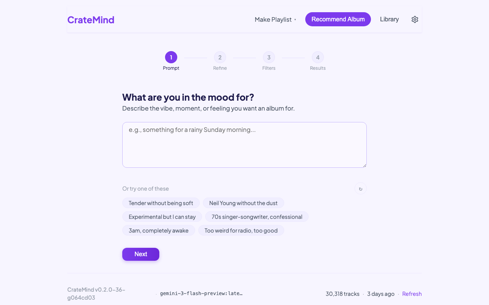
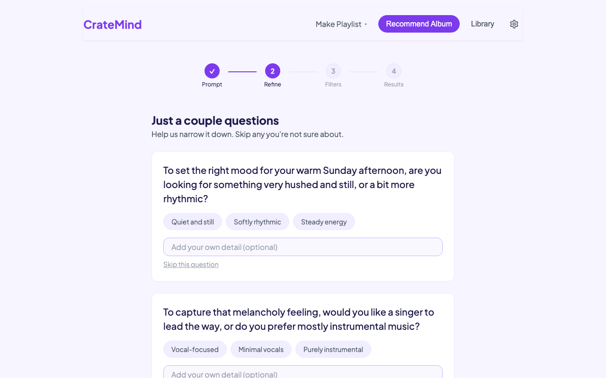
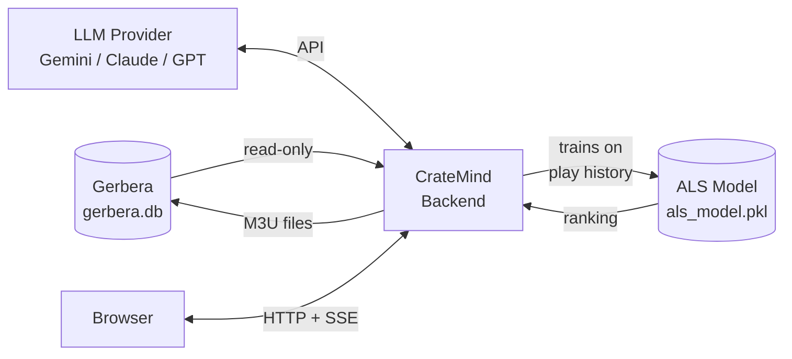
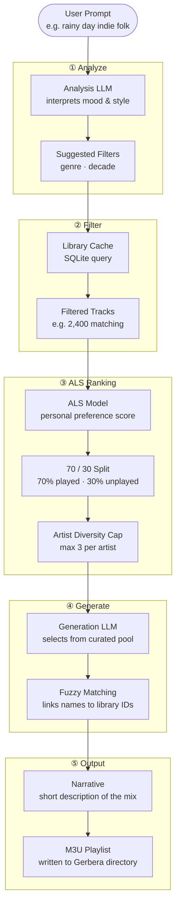
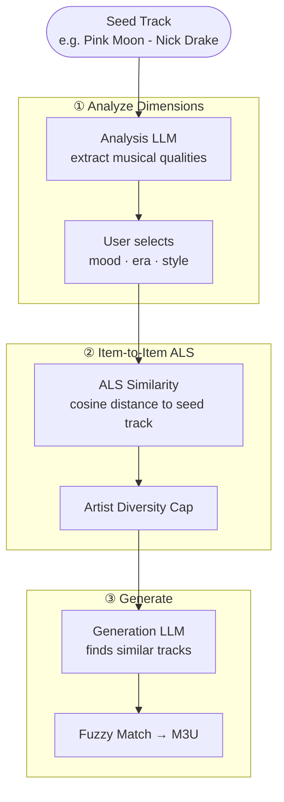
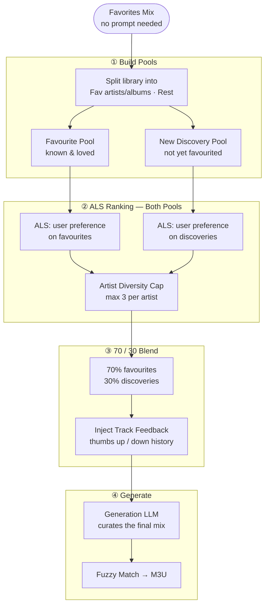
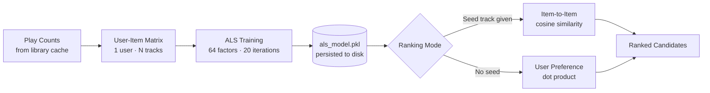

# CrateMind

[](https://opensource.org/licenses/MIT)
[](https://ghcr.io/langdar2/cratemind)
[](https://www.python.org/downloads/)

**AI-powered playlists and album recommendations for your self-hosted music library — using only music you actually own.**

CrateMind is a self-hosted web app that creates playlists and recommends albums by combining LLM intelligence with your local music library. It reads directly from [Gerbera's](https://gerbera.io) SQLite database and saves playlists as M3U files back into Gerbera's watched directory — no cloud accounts, no streaming services, no missing tracks.

| | | |
|--|--|--|
|  |  |  |
| *Home* | *Playlist Setup* | *Generated Playlist* |
|  |  | |
| *Album Recommender* | *Album Result* | |

---

## Quick Start

```bash
docker run -d \
  --name cratemind \
  -p 5765:5765 \
  -e GERBERA_DB_PATH=/gerbera/gerbera.db \
  -e GERBERA_PLAYLIST_OUTPUT_DIR=/music/playlists \
  -e GEMINI_API_KEY=your-key \
  -v /path/to/gerbera.db:/gerbera/gerbera.db:ro \
  -v /path/to/playlists:/music/playlists \
  --restart unless-stopped \
  ghcr.io/langdar2/cratemind:latest
```

Open **http://localhost:5765** — a setup wizard walks you through connecting to your Gerbera database and choosing an AI provider.

**Requirements:** Docker, a running [Gerbera](https://gerbera.io) DLNA server, and an API key from Google, Anthropic, or OpenAI (or a local model via Ollama).

---

## Contents

- [Why CrateMind?](#why-cratemind)
- [Features](#features)
- [How Playlist Generation Works](#how-playlist-generation-works)
- [Installation](#installation)
- [Configuration](#configuration)
- [Development](#development)
- [API Reference](#api-reference)

---

## Why CrateMind?

**Self-hosted music fans have few good options for AI playlists.**

Generic tools like ChatGPT recommend from an infinite catalog with no awareness of what you actually own. The result is a list of tracks you may not have. CrateMind inverts the approach: it only ever sees your library, so every suggestion is guaranteed to exist on your machine.

| Other tools (ChatGPT, etc.) | CrateMind |
|-----------------------------|-----------|
| AI recommends from infinite catalog | AI only sees your library |
| Results may not exist locally | No missing tracks possible |
| Near-empty playlists | Full playlists, every time |
| Generic taste | Learns your personal play history |

Playlists are written as M3U files directly into Gerbera's watched directory, so they appear immediately in any DLNA client on your network.

---

## Features

### Playlist Generation — Two Modes

**Describe what you want (Prompt mode)**
Natural language prompts like:
- *"Melancholy 90s alternative for a rainy day"*
- *"Upbeat instrumental jazz for a dinner party"*
- *"Late night electronic, nothing too aggressive"*

The AI interprets your mood and musical intent, filters your library accordingly, and curates a playlist — all from tracks you already own.

**Start from a song (Seed Track mode)**
Pick a track you love and explore its musical dimensions: mood, era, instrumentation, genre, production style. Select which qualities to emphasise and let CrateMind find similar tracks in your library.

### Favorites Mix

Generate a smart mix that balances the music you know and love with fresh discoveries from your own library:
- **70% favourited artists/albums** — your personal comfort zone
- **30% new discoveries** — similar tracks you haven't heard as much
- Ranked by your personal listening history so the best picks come first

### ALS-Based Personal Ranking

CrateMind trains a recommendation model (Alternating Least Squares) on your play history. Every playlist — regardless of mode — uses this model to rank candidates by how well they match your personal taste before the AI makes its final selection.

See [How Playlist Generation Works](#how-playlist-generation-works) for full detail.

### Track Feedback

Rate individual tracks in a generated playlist with thumbs up (👍) or thumbs down (👎). This feedback is stored and injected into future playlist prompts, so the AI learns what you actually want.

### Smart Filtering

Before the AI sees anything, you control the pool:
- **Genres** — select from your library's actual genre tags
- **Decades** — filter by era
- **Play count** — only tracks you've listened to at least N times
- **Exclude live versions** — skip concert recordings automatically

Real-time track counts show exactly how many tracks match your filters.

### Artist Diversity

CrateMind enforces diversity rules so one artist doesn't dominate a playlist:
- Maximum **3 tracks per artist** per playlist
- **No consecutive tracks by the same artist**

### Album Recommendations

Describe a mood or moment, answer two quick questions about your preferences, and get a single perfect album with an editorial pitch explaining why it fits.

- **Library mode** — recommends albums you already own
- **Discovery mode** — suggests albums you don't own yet, based on your taste profile
- **Familiarity control** — choose between comfort picks, hidden gems, or rediscoveries
- **Show Me Another** — regenerate without starting over
- Primary recommendation with a full write-up, plus two secondary picks
- Pitches are fact-checked against MusicBrainz and Cover Art Archive

### Multi-Provider LLM Support

| Provider | Max Tracks | Typical Cost | Best For |
|----------|------------|--------------|----------|
| **Google Gemini** | ~18,000 | $0.03 – $0.25 | Large libraries, lowest cost |
| **Anthropic Claude** | ~3,500 | $0.15 – $0.25 | Nuanced recommendations |
| **OpenAI GPT** | ~2,300 | $0.05 – $0.10 | Solid all-around |
| **Ollama** ⚗️ | Varies | Free | Privacy, local inference |
| **Custom** ⚗️ | Configurable | Free | Self-hosted, OpenAI-compatible APIs |

⚗️ *Local LLM support is experimental.*

> **Free option:** Google Gemini has a free API tier that's more than enough for personal use — no credit card required.

### Settings & Library Tools

- **AlbumArtist Patch** — if Gerbera stores track performers under `upnp:artist` instead of the album artist, this one-click tool corrects the cached artist names using `upnp:albumArtist` without requiring a full library resync
- **Library Statistics** — track count, genres, and decades at a glance

---

## How Playlist Generation Works

CrateMind uses a multi-stage pipeline that combines machine learning ranking with LLM curation. The goal: send the AI a smaller, smarter pool of candidates so it can focus on quality over quantity.

### System Overview



### Prompt Playlist Pipeline

This is the full flow when you describe what you want in natural language:



**Step by step:**

| Step | What happens | Why |
|------|-------------|-----|
| **① Analyze** | A smarter (more capable) LLM reads your prompt and suggests genre and decade filters | Reduces 50k tracks to a relevant subset without the AI seeing everything |
| **② Filter** | The local SQLite cache applies your filters instantly | No round-trips to Gerbera needed; sub-100ms |
| **③ ALS Rank** | The ALS model scores every candidate by how well it fits your personal listening history, then splits played/unplayed 70/30 and enforces artist diversity | Ensures the AI sees your *best* candidates, not a random sample |
| **④ Generate** | A faster (cheaper) LLM receives the curated track list and selects the final playlist | Token-efficient: the pool is already filtered and ranked |
| **⑤ Output** | Fuzzy matching (token sort ratio, threshold 72) maps LLM track names to library IDs; a narrative is generated; the M3U is saved | Handles minor spelling differences between LLM output and actual tags |

### Seed Track Pipeline

When you start from a specific song, the flow differs in the ranking step:



Instead of user-preference ranking, the ALS model computes **item-to-item cosine similarity** between the seed track's latent vector and every candidate — surfacing tracks that are musically close to your starting point.

### Favorites Mix Pipeline



### ALS Model — How It Learns Your Taste

CrateMind embeds the [`implicit`](https://github.com/benfred/implicit) library to train an Alternating Least Squares model on your play history. Training happens automatically after every library sync.



**Fallback:** if the model hasn't been trained yet (e.g. first run with no play data), CrateMind falls back to sorting by play count — so you always get sensible results even before the model has learned anything.

---

## Installation

### Docker Compose (Recommended)

```bash
mkdir cratemind && cd cratemind
curl -O https://raw.githubusercontent.com/langdar2/cratemind/main/docker-compose.yml
```

Edit `docker-compose.yml` and set the environment variables and volume paths for your setup (see [Configuration](#configuration)).

```bash
docker compose up -d
```

### NAS Platforms

<details>
<summary><strong>Synology (Container Manager)</strong></summary>

**GUI:**
1. **Container Manager** → **Registry** → Search `ghcr.io/langdar2/cratemind`
2. Download `latest` tag
3. **Container** → **Create**
4. Port: 5765 → 5765
5. Add environment variables: `GERBERA_DB_PATH`, `GERBERA_PLAYLIST_OUTPUT_DIR`, `GEMINI_API_KEY`
6. Add volume mounts for your `gerbera.db` and playlist output directory

**Docker Compose:**
```bash
mkdir -p /volume1/docker/cratemind && cd /volume1/docker/cratemind
curl -O https://raw.githubusercontent.com/langdar2/cratemind/main/docker-compose.yml
nano docker-compose.yml  # set paths and API key
```
Then in **Container Manager** → **Project** → **Create**, point to `/volume1/docker/cratemind`.

</details>

<details>
<summary><strong>Unraid</strong></summary>

1. **Docker** → **Add Container**
2. Repository: `ghcr.io/langdar2/cratemind:latest`
3. Port: 5765 → 5765
4. Add variables: `GERBERA_DB_PATH`, `GERBERA_PLAYLIST_OUTPUT_DIR`, `GEMINI_API_KEY`
5. Add path mappings for your `gerbera.db` and playlist directory

</details>

<details>
<summary><strong>TrueNAS SCALE</strong></summary>

1. **Apps** → **Discover Apps** → **Custom App**
2. Image: `ghcr.io/langdar2/cratemind`, Tag: `latest`
3. Port: 5765
4. Add environment variables and storage paths

</details>

<details>
<summary><strong>Portainer</strong></summary>

**Stacks** → **Add Stack**:

```yaml
services:
  cratemind:
    image: ghcr.io/langdar2/cratemind:latest
    ports:
      - "5765:5765"
    environment:
      - GERBERA_DB_PATH=/gerbera/gerbera.db
      - GERBERA_PLAYLIST_OUTPUT_DIR=/music/playlists
      - GEMINI_API_KEY=your-key
    volumes:
      - /path/to/gerbera.db:/gerbera/gerbera.db:ro
      - /path/to/playlists:/music/playlists
      - ./data:/app/data
    restart: unless-stopped
```

</details>

### Bare Metal (No Docker)

CrateMind is Python + FastAPI with no native dependencies beyond `numpy`/`scipy` (bundled in the Docker image). It runs on any machine with Python 3.11+.

```bash
git clone https://github.com/langdar2/cratemind.git
cd cratemind
python -m venv venv
source venv/bin/activate
pip install -r requirements.txt
```

Set your environment variables:

```bash
export GERBERA_DB_PATH=/path/to/gerbera.db
export GERBERA_PLAYLIST_OUTPUT_DIR=/path/to/playlists
export GEMINI_API_KEY=your-gemini-key
```

Start:

```bash
uvicorn backend.main:app --host 0.0.0.0 --port 5765
```

<details>
<summary><strong>Running as a background service (systemd)</strong></summary>

```ini
# /etc/systemd/system/cratemind.service
[Unit]
Description=CrateMind
After=network.target

[Service]
Type=simple
User=your-user
WorkingDirectory=/path/to/cratemind
EnvironmentFile=/path/to/cratemind/.env
ExecStart=/path/to/cratemind/venv/bin/uvicorn backend.main:app --host 0.0.0.0 --port 5765
Restart=on-failure

[Install]
WantedBy=multi-user.target
```

```bash
sudo systemctl enable cratemind
sudo systemctl start cratemind
```

</details>

---

## Configuration

### Environment Variables

| Variable | Required | Description |
|----------|----------|-------------|
| `GERBERA_DB_PATH` | Yes | Path to your `gerbera.db` file |
| `GERBERA_PLAYLIST_OUTPUT_DIR` | Yes | Directory where M3U playlists are written (must be watched by Gerbera) |
| `GERBERA_MIN_PLAY_COUNT` | No | Only include tracks with at least this many plays (default: `0` = all) |
| `GEMINI_API_KEY` | One required | Google Gemini API key |
| `ANTHROPIC_API_KEY` | One required | Anthropic API key |
| `OPENAI_API_KEY` | One required | OpenAI API key |
| `LLM_PROVIDER` | No | Force provider: `gemini`, `anthropic`, `openai`, `ollama`, `custom` |
| `OLLAMA_URL` | No | Ollama server URL (default: `http://localhost:11434`) |
| `CUSTOM_LLM_URL` | No | Custom OpenAI-compatible API base URL |
| `CUSTOM_LLM_API_KEY` | No | API key for custom provider |
| `CUSTOM_CONTEXT_WINDOW` | No | Context window size for custom provider (default: 32768) |

### Web UI Configuration

All settings can also be configured through the **Settings** page. Settings are saved to `config.user.yaml` and persist across restarts. Environment variables always take priority.

### Advanced: config.yaml

```yaml
gerbera:
  db_path: "/home/user/gerbera.db"
  playlist_output_dir: "/media/music/playlists"
  min_play_count: 0  # 0 = all tracks; e.g. 3 = only tracks with ≥ 3 plays

llm:
  provider: "gemini"
  model_analysis: "gemini-2.5-flash"
  model_generation: "gemini-2.5-flash"
  smart_generation: false  # true = use smarter model for both (higher quality, ~3-5x cost)

defaults:
  track_count: 25
```

### Model Selection

CrateMind uses a two-model strategy by default:

| Role | Purpose | Default Models |
|------|---------|---------------|
| **Analysis** | Interpret prompts, suggest filters, analyze seed tracks | claude-sonnet-4-5 / gpt-4.1 / gemini-2.5-flash |
| **Generation** | Select tracks from the curated candidate pool | claude-haiku-4-5 / gpt-4.1-mini / gemini-2.5-flash |

Enable `smart_generation: true` to use the analysis model for both steps (higher quality, ~3–5× cost).

### Local LLM Setup (Experimental)

<details>
<summary><strong>Ollama</strong></summary>

1. Install [Ollama](https://ollama.ai) and pull a model:
   ```bash
   ollama pull llama3:8b
   ```

2. Configure CrateMind:
   ```bash
   LLM_PROVIDER=ollama
   OLLAMA_URL=http://localhost:11434
   ```

3. Select your model in Settings — the context window is auto-detected.

**Recommended models:** `llama3:8b`, `qwen3:8b`, `mistral` — models with 8K+ context work best.

</details>

<details>
<summary><strong>Custom OpenAI-Compatible API</strong></summary>

For LM Studio, text-generation-webui, vLLM, or any OpenAI-compatible server:

1. Start your server with an OpenAI-compatible endpoint
2. Configure in Settings:
   - **API Base URL:** `http://localhost:5000/v1`
   - **API Key:** if required by your server
   - **Model Name:** the model identifier
   - **Context Window:** your model's context size

</details>

---

## Development

### Local Setup

```bash
git clone https://github.com/langdar2/cratemind.git
cd cratemind
python -m venv venv
source venv/bin/activate
pip install -r requirements.txt

export GERBERA_DB_PATH=/path/to/gerbera.db
export GERBERA_PLAYLIST_OUTPUT_DIR=/path/to/playlists
export GEMINI_API_KEY=your-key

uvicorn backend.main:app --reload --port 5765
```

### Testing

```bash
pytest tests/ -v
```

### Tech Stack

| Layer | Technology |
|-------|-----------|
| Backend | Python 3.11+, FastAPI, uvicorn |
| Recommendation | `implicit` (ALS), `numpy`, `scipy` |
| Fuzzy matching | `rapidfuzz` (token sort ratio) |
| Library source | Gerbera SQLite (read-only) |
| Playlist output | Extended M3U |
| LLM SDKs | `anthropic`, `openai`, `google-genai`, Ollama REST |
| HTTP client | `httpx` |
| Frontend | Vanilla HTML / CSS / JS (no build step) |
| Deployment | Docker (multi-stage, `linux/amd64` + `linux/arm64`) |

### Project Structure

```
backend/
├── main.py              # FastAPI app, all routes
├── config.py            # Config loading (YAML + env vars)
├── gerbera_client.py    # Reads Gerbera SQLite (tracks + albumArtist)
├── library_cache.py     # Local SQLite cache, sync, filtering, ALS patch
├── als_recommender.py   # ALS model wrapper (train, rank, persist)
├── generator.py         # Playlist generation pipeline
├── analyzer.py          # Prompt analysis + seed track dimensions
├── llm_client.py        # LLM provider abstraction
├── recommender.py       # Album recommendation pipeline
└── models.py            # Pydantic models

frontend/
├── index.html           # Single page app
├── style.css            # Dark theme (Plexamp aesthetic)
└── app.js               # All UI logic

data/
├── library_cache.db     # Cached track metadata
└── als_model.pkl        # Trained ALS model (auto-generated)
```

---

## API Reference

Interactive documentation available at `/docs` when running.

| Endpoint | Method | Description |
|----------|--------|-------------|
| `/api/health` | GET | Health check |
| `/api/config` | GET/POST | Get or update configuration |
| `/api/setup/status` | GET | Onboarding checklist state |
| `/api/setup/validate-ai` | POST | Validate AI provider credentials |
| `/api/setup/complete` | POST | Mark setup wizard as complete |
| `/api/browse` | GET | Browse filesystem (for path pickers) |
| `/api/library/status` | GET | Library state and track count |
| `/api/library/sync` | POST | Re-read library from Gerbera database |
| `/api/library/patch-album-artists` | POST | Patch artist names using `upnp:albumArtist` |
| `/api/library/stats` | GET | Genre, decade, and artist statistics |
| `/api/library/search` | GET | Search library tracks |
| `/api/library/artists` | GET | List all artists with stats |
| `/api/library/albums` | GET | List all albums with stats |
| `/api/favorites/toggle` | POST | Mark/unmark an artist or album as favourite |
| `/api/feedback/track` | POST | Save thumbs up/down rating for a track |
| `/api/feedback/tracks` | GET | Get all stored track ratings |
| `/api/analyze/prompt` | POST | Analyze natural language prompt → filters |
| `/api/analyze/track` | POST | Analyze a seed track → musical dimensions |
| `/api/filter/preview` | POST | Preview filtered track count + cost estimate |
| `/api/generate/stream` | POST | Generate playlist (SSE streaming) |
| `/api/generate/favorites` | POST | Generate a Favorites Mix (SSE streaming) |
| `/api/playlist` | POST | Save playlist as M3U file |
| `/api/recommend/albums/preview` | GET | Preview album candidates for filters |
| `/api/recommend/analyze-prompt` | POST | Analyze prompt for genre/decade filters |
| `/api/recommend/questions` | POST | Generate clarifying questions |
| `/api/recommend/generate` | POST | Generate album recommendations (SSE) |
| `/api/recommend/switch-mode` | POST | Switch between library/discovery mode |
| `/api/results` | GET | List saved result history |
| `/api/results/{id}` | GET/DELETE | Get or delete a saved result |
| `/api/external-art` | GET | Proxy album art from Cover Art Archive |
| `/api/ollama/status` | GET | Ollama connection status |
| `/api/ollama/models` | GET | List available Ollama models |
| `/api/ollama/model-info` | GET | Get model details (context window) |

---

## License

MIT
